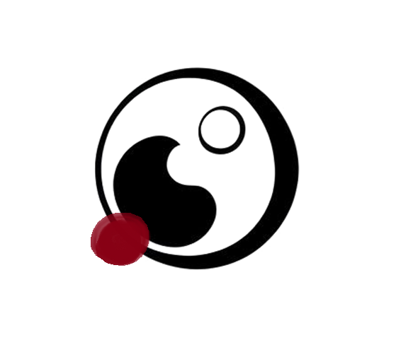

<p align="center">
  
</p>

# ksingiak: a philosophical language project

<p align="center">
| <a href="https://cjwhite1906.github.io/ksingiak/public-repo/wiki/ksingiak-peoples-republic.html"><b>Wiki</b></a> |

## Overview

**ksingiak** is a constructed language project first envisioned very early on in my life and produced through years of ardent study and practice in the study and pursuit of knowledge and understanding, inspired by a profound love and appreciation for what language is and can be.

<br>

## Objectives

* *Concise, Analytical, and Rigorously Formalized* | **ksingiak** should be a *logical* language, but not uncompromisingly so. It should be a distinct framework for communication that is systematically constructed, making use of computational and analytical methods and tools to optimize semantic accuracy and precision in a lightweight and agile way. It should constitute a framework for communicating nuanced ideas with a high degree of specificity, succinctness, and predictability while allowing for the possibility to express the inherently subjective and uniquely human characteristics of experience.
* *Elegant, Syncretic, and Aesthetically Unmistakeable* | **ksingiak** should have a unique personality and character. It should incorporate into the essence of the language an affinity for patterns, rhythm, and euphonicity---paying homage to those qualities of various natural languages that inspire profound reflection on the diversity and complexity of human thought. There is no reason why even the most analytically-designed engineered language should not be able to be used to construct the most beautiful poetry.
* *Philosophically Oriented and Consciousness-Raising* | **ksingiak** as a project should present a cogent and consolidated philosophical view which builds upon wide-ranging influences from world knowledge-traditions, and should provoke serious thought by the reader upon the nature of language, meaning, knowledge, and existence. It should evoke a deeper appreciation of languages which are well-known and prevalent, as well as raise awareness for those nearing extinction. It is greatly informed and inspired by efforts to sustain the cultural preservation of indigenous languages and cultures, as well as our mutual interconnectedness with all of the peoples of the world through the common linkages of language and our shared humanity.
<br>

## Citation
```bibtex
@online{ksingiak,
      title={{ksingiak}}, 
      author={Cameron White},
      year={2026},
      url={https://github.com/cjwhite1906/ksingiak}
}
```
